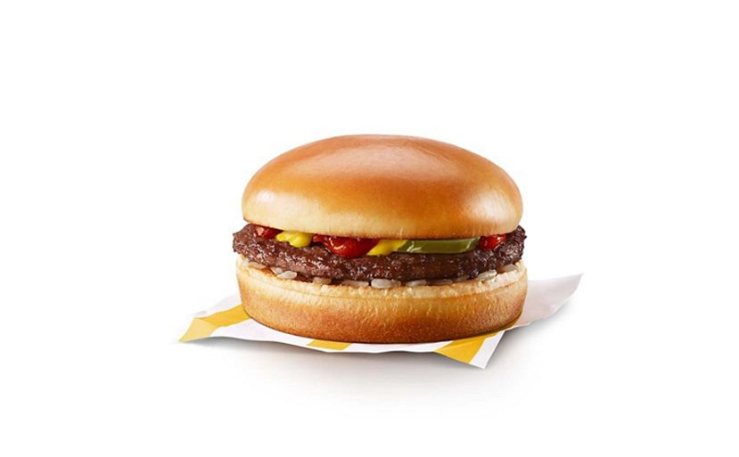

```{r setup, include=FALSE}
knitr::opts_chunk$set(echo = FALSE,message = FALSE,warning = FALSE)
```

this is my big ol report that I like to show off to people to impress them
 I cana **bold** shit and make it *slanty*

behold, my plot of penwangs:

```{r}
library(palmerpenguins)
library(tidyverse)
penguins %>% names

penguins %>% 
  ggplot(aes(x=sex,
             y=body_mass_g,
             color=species))+
  geom_boxplot()


```
here is pic of hamb:
```{r,out.height=600,out.width=800}

```
exam 3 and final markdown will be rmd
website hosting final, rmd

week 11  notes

